# SAWM Individual Work
Отчет о безопасности веб-приложения сделанного по ТЗ.

**Студент: Григорий Зайка**

**Группа: I2302, 3 курс**

<p>


          
</p>

## Тема: "Каталог компьютерных комплектующих"

### **1. Описание архитектуры приложения и используемых технологий**

#### **Архитектурный стиль**
Трехзвенная архитектура (MVC-подобная):
- **Презентационный слой**: PHP-скрипты в директории `/public/` (HTML + PHP)
- **Бизнес-логика**: Классы в директории `/core/` (Auth, Database, Validator, Logger)
- **Слой данных**: SQLite база данных в `/database/`

#### **Используемые технологии**
- **Backend**: `PHP 8.0+` с нативной объектно-ориентированной архитектурой
- **База данных**: `SQLite` с PDO (PHP Data Objects)
- **Хэширование паролей**: `Argon2id` (современный алгоритм)
- **Веб-сервер**: `PHP` (localhost)
- **Фронтенд**: `Vanilla HTML/CSS` без JavaScript фреймворков
- **Протокол**: `HTTP` (localhost)

#### **Структура проекта**
```
:./
├── config/          # Конфигурационные файлы
├── core/            # Ядро приложения (классы)
├── database/        # Файлы базы данных SQLite
├── logs/            # Журналы ошибок и безопасности
├── public/          # Публичная часть приложения
├── README           # markdown отчет
└── screenshots/     # Скриншоты
```

#### **Имплементации проекта**
- Страница для гостей с возможностью просмотра последних товаров
- Страница регистрации
- Страница авторизации
- Страница просмотра запчастей
    - Страница для администраторов (расширенные возможности страницы запчастей)
    - Страница для менеджеров (расширенные возможности страницы запчастей)
- Админ-панель с возможностью:
    - просмотра логов ошибок, 
    - просмотра журналов активности 
    - управления пользователями

#### Возможности приложения "Каталог компьютерных комплектующих"

#### 🔐 **Аутентификация и авторизация**
##### ✅ Регистрация пользователей
- Валидация всех полей (имя пользователя, email, пароль)
- Проверка сложности пароля (мин. 8 символов, заглавные/строчные буквы, цифры, спецсимволы)
- Проверка уникальности имени пользователя и email
- Автоматическое хэширование пароля с использованием Argon2id
- Подтверждение пароля при регистрации

##### ✅ Вход в систему
- Проверка имени пользователя и пароля
- Защита от брутфорса (блокировка аккаунта после 5 неудачных попыток на 15 минут)
- Автоматическая разблокировка после истечения времени
- Обнуление счетчика неудачных попыток при успешном входе

##### ✅ Управление сессиями
- Безопасное хранение сессионных данных
- Автоматическая регенерация ID сессии каждые 30 минут
- Проверка времени жизни сессии (таймаут 1 час)
- Защита от фиксации сессии
- Управление параметрами сессионных cookies (httponly, samesite)

#### 👥 **Система ролей и доступов**
##### 🎫 Три уровня доступа:
1. **Гость (guest)** - базовый уровень:
   - Просмотр главной страницы
   - Просмотр каталога товаров без фильтров
   - Регистрация в системе

2. **Менеджер (manager)** - расширенный уровень:
   - Все права гостя
   - Добавление новых товаров
   - Редактирование своих товаров
   - Удаление своих товаров

3. **Администратор (admin)** - полный доступ:
   - Все права менеджера
   - Доступ к админ-панели
   - Управление пользователями
   - Просмотр системных логов
   - Редактирование и удаление ЛЮБЫХ товаров

#### 🏪 **Управление каталогом товаров**
##### 📦 Основные операции:
- **Просмотр каталога** - доступен всем пользователям
- **Фильтрация товаров** по категориям
- **Поиск товаров** по названию, производителю, описанию
- **Сортировка** по дате добавления

##### ✏️ Для авторизованных пользователей:
- **Добавление новых товаров** (менеджеры и администраторы)
- **Редактирование товаров** (только своих для менеджеров, любых для администраторов)
- **Удаление товаров** (только своих для менеджеров, любых для администраторов)

##### 🏷️ Характеристики товаров:
- Название (3-100 символов)
- Категория (выбор из 10 предопределенных)
- Производитель (2-50 символов)
- Цена (0.01-999999.99)
- Описание (до 500 символов, опционально)
- Автор добавления
- Дата и время добавления

#### 🛡️ **Административная панель**
##### 👥 Управление пользователями:
- **Просмотр списка** всех пользователей с ролями
- **Изменение ролей** (гость ↔ менеджер ↔ администратор)
- **Сброс паролей** пользователей с установкой нового пароля
- **Удаление пользователей** (кроме себя самого)
- **Просмотр даты регистрации** каждого пользователя

##### 📊 Просмотр логов:
- **Логи ошибок** - просмотр файла errors.log
- **Логи безопасности** - просмотр файла security.log
- **Фильтрация логов** по тексту в реальном времени
- **Автоматическое обновление** логов (каждые 30 секунд)

##### 📈 Статистика:
- Общее количество пользователей
- Общее количество товаров
- Количество записей в логах действий
- Количество категорий товаров
- Количество производителей

#### 📊 **Главная страница**
##### 🌟 Общедоступный контент:
- **Приветственный блок** с описанием системы
- **Статистика каталога** (количество товаров, категорий, производителей)
- **Последние добавленные товары** (6 последних)
- **Краткая информация** о возможностях системы
- **Кнопки навигации** в зависимости от роли пользователя

##### 🔍 Для неавторизованных пользователей:
- Кнопка "Зарегистрироваться"
- Кнопка "Войти в систему"

##### 🛠️ Для авторизованных пользователей:
- Приветствие с именем пользователя и ролью
- Кнопка "Добавить товар" (для менеджеров и администраторов)
- Кнопка "Админ-панель" (только для администраторов)

#### 🛡️ **Система безопасности**
##### 🚫 Защита от атак:
- **SQL Injection** - использование подготовленных запросов (PDO)
- **XSS (Cross-Site Scripting)** - экранирование вывода через htmlspecialchars()
- **Command Injection** - валидация всех входных данных
- **Brute Force** - блокировка аккаунтов и rate limiting
- **Session Hijacking** - регенерация ID сессии

##### 🔐 Хранение паролей:
- Использование **Argon2id** - современного алгоритма хэширования
- Автоматическая генерация "соли"
- Настраиваемые параметры сложности (память, время, потоки)
- Проверка с использованием password_verify()

##### 📝 Журналирование:
- **Логи безопасности** - все попытки входа, регистрации, подозрительные действия
- **Логи ошибок** - все ошибки приложения
- **Логи действий пользователей** - кто, что и когда сделал
- **Фильтрация конфиденциальных данных** в логах

#### 🎨 **Интерфейс и навигация**
##### 🔤 Единая навигационная панель:
- Отображается на всех страницах
- Адаптивный дизайн
- Показывает текущего пользователя и его роль
- Динамическое изменение меню в зависимости от роли

##### 📱 Адаптивный дизайн:
- Поддержка мобильных устройств
- Гибкие сетки товаров
- Удобные формы ввода
- Четкая иерархия информации

##### ⚡ Удобство использования:
- Интуитивно понятный интерфейс
- Быстрая навигация между разделами
- Четкие сообщения об ошибках
- Подтверждение важных действий (удаление, сброс пароля)

#### ⚙️ **Технические возможности**
##### 🗄️ Работа с базой данных:
- Использование **SQLite** для простоты развертывания
- **Автоматическое создание** структуры БД при первом запуске
- **Подготовленные запросы** для всех операций
- **Внешние ключи** для целостности данных

##### 🔧 Конфигурирование:
- Централизованный файл конфигурации
- Настраиваемые параметры безопасности
- Настраиваемые лимиты и ограничения
- Простое изменение настроек без изменения кода

##### 🧪 Автоматизация:
- Создание первого администратора при инициализации БД
- Автоматическое создание необходимых директорий
- Автоматическое обновление счетчиков и блокировок

#### 🔄 **Процессы и рабочие потоки**
##### 📝 Типовой сценарий работы менеджера:
1. Регистрация/вход в систему
2. Просмотр существующих товаров
3. Добавление нового товара через форму
4. Редактирование информации о своих товарах
5. Удаление устаревших товаров

##### ⚙️ Типовой сценарий работы администратора:
1. Вход с правами администратора
2. Просмотр статистики на главной странице
3. Переход в админ-панель
4. Управление пользователями (назначение ролей, сброс паролей)
5. Просмотр логов безопасности и ошибок
6. Редактирование/удаление любых товаров при необходимости

##### 🎫 Типовой сценарий работы гостя:
1. Просмотр главной страницы
2. Просмотр каталога товаров
3. Регистрация в системе
4. Ожидание назначения роли менеджера администратором

#### 🛠️ **Дополнительные функции**
##### 📅 Управление паролями:
- Ротация паролей (настраиваемый срок действия - по умолчанию 90 дней)
- Требование смены пароля при истечении срока
- Сброс пароля через админ-панель
- Политика надежных паролей

##### 📋 Аудит и мониторинг:
- Запись IP-адресов пользователей
- Запись User-Agent браузеров
- Временные метки всех действий
- Возможность отслеживания подозрительной активности

##### 🚀 Производительность:
- Оптимизированные запросы к базе данных
- Эффективное использование памяти
- Быстрая обработка форм
- Минимальные требования к серверу

#### 🔌 **Интеграции и расширения**
##### 📁 Структура проекта:
- Четкое разделение на слои (конфигурация, ядро, публичная часть)
- Возможность легкого расширения функционала
- Простое добавление новых страниц и функций
- Готовность к переходу на другие СУБД (MySQL, PostgreSQL)

##### 🐳 Готовность к развертыванию:
- Простая установка на любом хостинге с поддержкой PHP
- Возможность контейнеризации через Docker
- Минимальные системные требования
- Подробная документация по настройке

#### **Демонстрация работы программы**
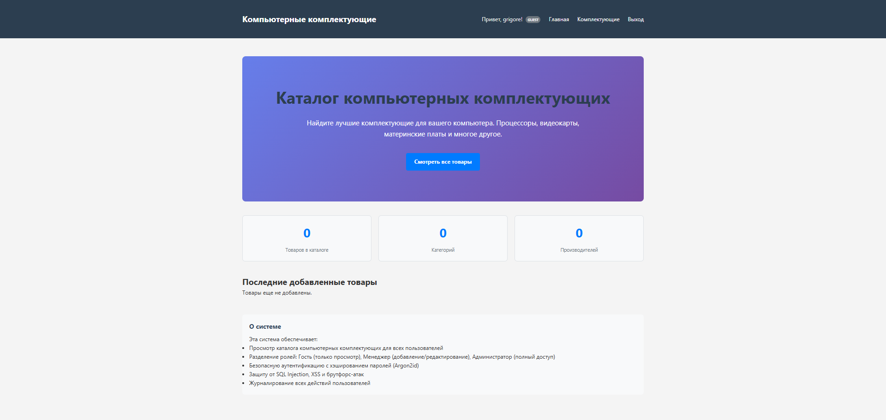
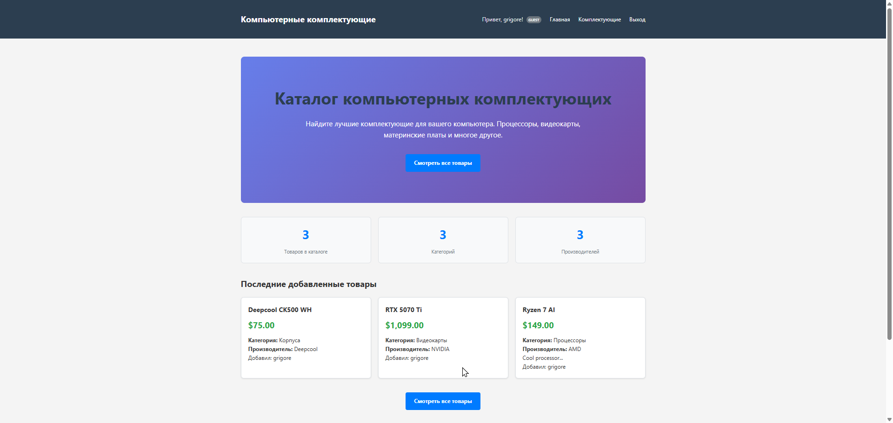
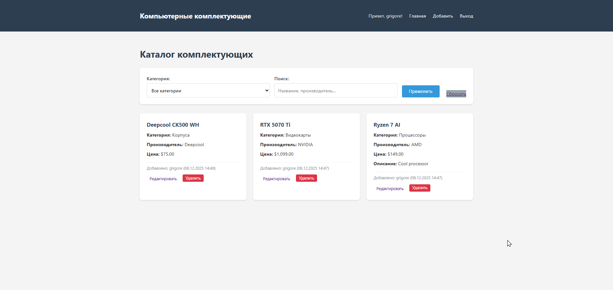
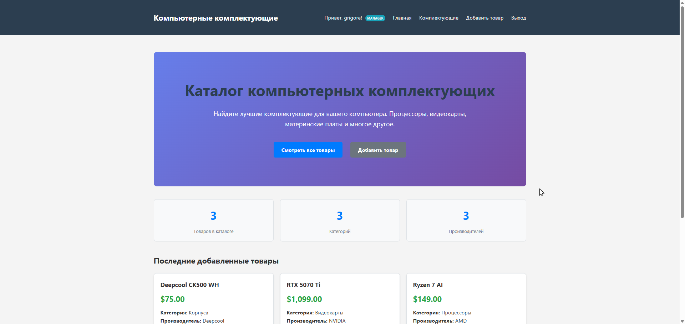
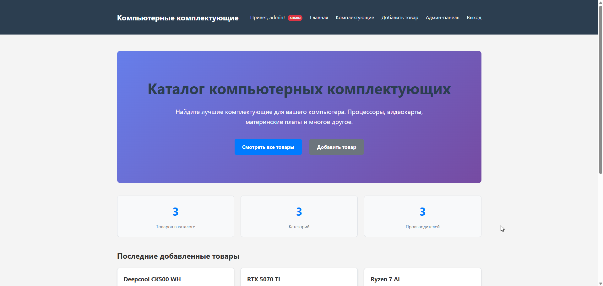
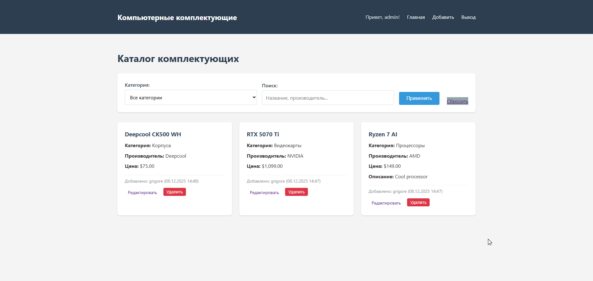
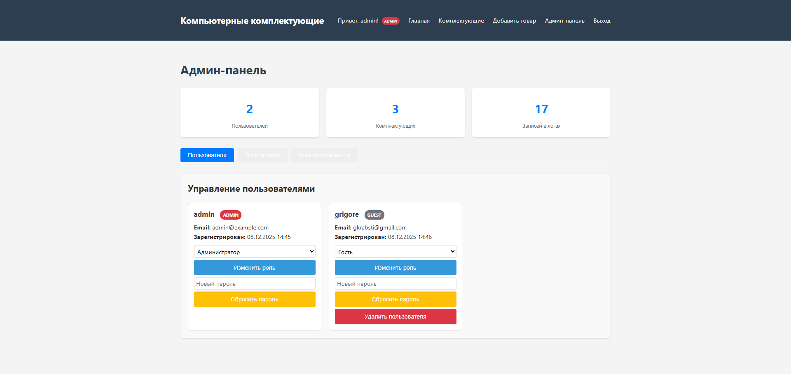
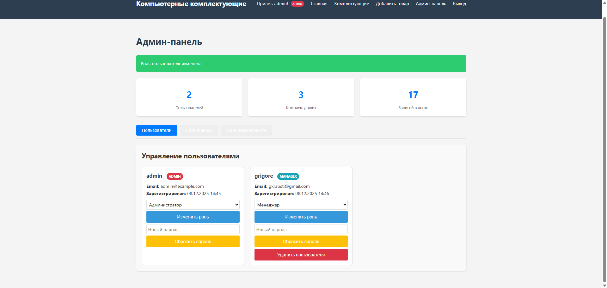
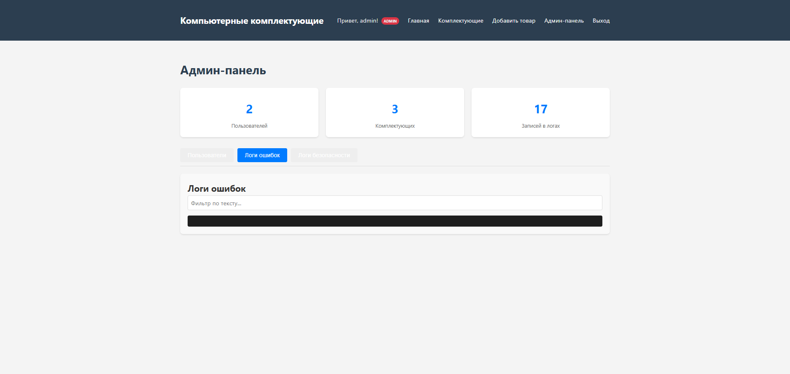


### **2. Перечисление всех возможных уязвимостей (согласно [OWASP Top 10 2025](https://owasp.org/Top10/2025/))**

#### [**`A01:2025 - Broken Access Control`**](https://owasp.org/Top10/2025/A01_2025-Broken_Access_Control/)
- **CSRF (Cross-Site Request Forgery)**: Отсутствие CSRF-токенов во всех формах
- **Небезопасные прямые ссылки на объекты**: Возможен доступ к данным других пользователей через модификацию параметров
- **Отсутствие rate limiting**: Нет ограничения запросов по IP-адресу

#### [**`A02:2025 - Security Misconfiguration`**](https://owasp.org/Top10/2025/A02_2025-Security_Misconfiguration/)
- **Отсутствие security headers**: Нет CSP, X-Frame-Options, HSTS
- **Отладочная информация**: Возможна утечка информации через сообщения об ошибках
- **Неправильные настройки сессии**: Отсутствие secure flag для кук

#### [**`A04:2025 - Cryptographic Failures`**](https://owasp.org/Top10/2025/A04_2025-Cryptographic_Failures/)
- **Отсутствие HTTPS**: Сессионные куки передаются по HTTP
- **Timing-атаки**: Разное время ответа для существующих/несуществующих пользователей
- **Хранение конфиденциальных данных в логах**: Возможна утечка паролей при неправильном логировании

#### [**`A05:2025 - Injection`**](https://owasp.org/Top10/2025/A05_2025-Injection/)
- **SQL Injection**: Частично защищено, но есть уязвимости в LIKE-запросах
- **XSS (Cross-Site Scripting)**: Защищено на выходе, но есть риски в динамических запросах
- **Command Injection**: Нет защиты от инъекций команд в системных вызовах

#### [**`A07:2025 - Authentication Failures`**](https://owasp.org/Top10/2025/A07_2025-Authentication_Failures/)
- **Отсутствие 2FA**: Нет двухфакторной аутентификации
- **Слабая политика паролей**: Минимальная длина 8 символов может быть недостаточной
- **Предсказуемые сессионные ID**: Возможна фиксация сессии

### **3. Детальное объяснение реализованных механизмов предотвращения уязвимостей**

#### **3.1 Защита от SQL Injection**
```php
// Database.php - подготовленные запросы
public function select($query, $params = []) {
    $stmt = $this->connection->prepare($query);
    $stmt->execute($params);  // Параметры обрабатываются безопасно
    return $stmt->fetchAll();
}
```
> **Как работает**: Все пользовательские данные передаются как параметры, а не как часть SQL-запроса, что предотвращает выполнение произвольного SQL-кода.

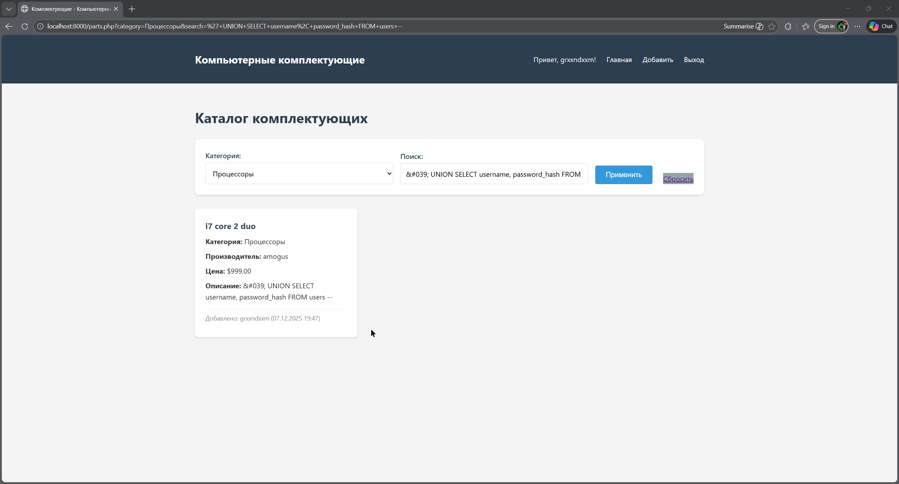

#### **3.2 Защита от XSS (Cross-Site Scripting)**
```php
// Validator.php - санитизация выходных данных
public static function sanitize($data) {
    $data = htmlspecialchars($data, ENT_QUOTES, 'UTF-8');
    return $data;
}

// В шаблонах
<input value="<?= htmlspecialchars($_POST['username'] ?? '') ?>">
```
> **Как работает**: Все пользовательские данные преобразуются в HTML-сущности перед выводом в браузер, что предотвращает выполнение JavaScript-кода.

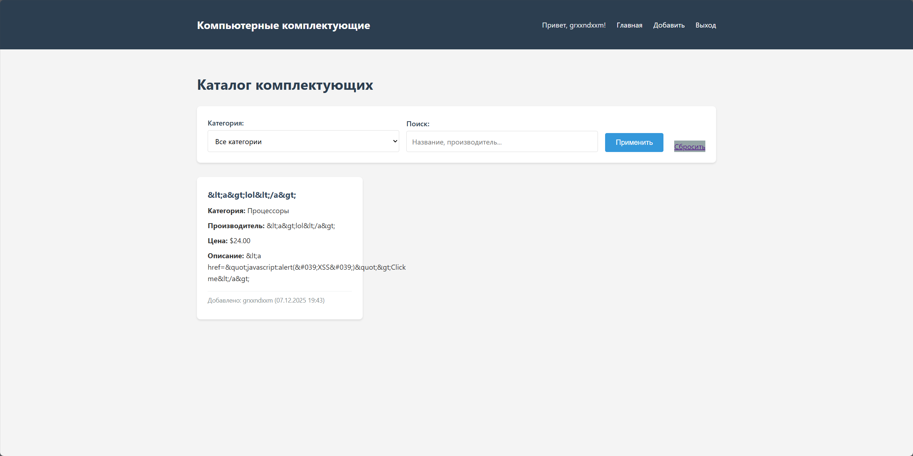

#### **3.3 Безопасное хранение паролей (Argon2id)**
```php
// Auth.php - хэширование паролей
$passwordHash = password_hash($password, PASSWORD_ARGON2ID, [
    'memory_cost' => 65536,  // 64 MB памяти
    'time_cost' => 4,        // 4 итерации
    'threads' => 3           // 3 потока
]);
```
> **Как работает**: Argon2id использует память и время для замедления перебора, соль добавляется автоматически, что делает атаки перебором непрактичными.

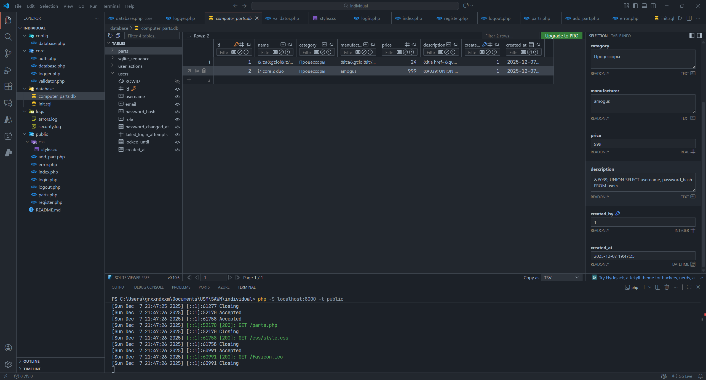

#### **3.4 Защита от брутфорс-атак**
```php
// Auth.php - блокировка аккаунта
if ($attempts >= MAX_LOGIN_ATTEMPTS) {
    $lockUntil = date('Y-m-d H:i:s', time() + LOGIN_LOCKOUT_TIME);
    $this->db->execute(
        'UPDATE users SET failed_login_attempts = ?, locked_until = ? WHERE id = ?',
        [$attempts, $lockUntil, $user['id']]
    );
}
```
> **Как работает**: После 5 неудачных попыток входа аккаунт блокируется на 15 минут, что замедляет автоматические атаки перебора.

#### **3.5 Безопасное управление сессиями**
```php
// Auth.php - защита сессий
private function startSecureSession() {
    session_regenerate_id(true);  // Регенерация ID при смене статуса
    $_SESSION['LAST_ACTIVITY'] = time();  // Таймаут сессии
}
```
> **Как работает**: Регулярная регенерация ID сессии предотвращает фиксацию, таймаут ограничивает время жизни сессии.

#### **3.6 Журналирование безопасности**
```php
// Logger.php - запись событий безопасности
public static function security($message, $context = []) {
    self::writeLog(LOG_PATH . 'security.log', 'SECURITY', $message, $context);
}

// Пример использования
Logger::security('Failed login attempt', ['username' => $username]);
```
> **Как работает**: Все подозрительные события записываются в отдельный лог с временными метками, IP-адресами и идентификаторами пользователей.

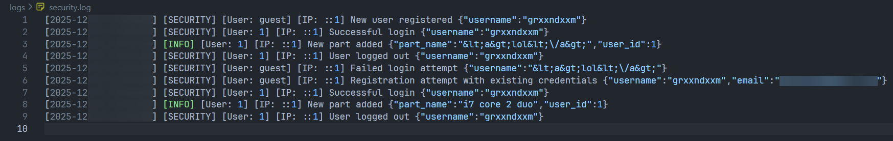

### **4. Анализ рисков безопасности и обоснование принятых технических решений**

#### **Принятые решения и их обоснование:**

##### **4.1 Использование `Argon2id` вместо `bcrypt`**
**Риск**: Атаки перебором с использованием GPU/ASIC
**Решение**: Argon2id потребляет значительный объем памяти (64MB), что делает атаки с использованием специализированного оборудования неэффективными
**Обоснование**: Argon2id победитель Password Hashing Competition 2015, рекомендован OWASP

##### **4.2 Подготовленные запросы вместо экранирования**

| Критерий        | Аргумент                                                                |
| --------------- | ----------------------------------------------------------------------- |
| **Риск**        | Ошибки экранирования, приводящие к SQL-инъекциям                        |
| **Решение**     | Использование prepared statements PDO                                   |
| **Обоснование** | Разделение кода и данных на уровне драйвера БД гарантирует безопасность |

##### **4.3 Централизованная валидация через класс `Validator`**

| Критерий        | Аргумент                                                |
| --------------- | ------------------------------------------------------- |
| **Риск**        | Непоследовательная валидация в разных частях приложения |
| **Решение**     | Единый класс валидации со стандартизированными методами |
| **Обоснование** | Упрощение аудита кода и поддержки                       |

##### **4.4 Раздельное логирование ошибок и событий безопасности**

| Критерий    | Аргумент                                                    |
| ----------- | ----------------------------------------------------------- |
| **Риск**    | Утечка конфиденциальной информации через логи               |
| **Решение** | Отдельные файлы логов с фильтрацией конфиденциальных данных |

```php
// Logger.php - фильтрация конфиденциальных данных
private static function sanitizeContext($context) {
    $sensitive = ['password', 'password_hash', 'token', 'secret'];
    foreach ($context as $key => $value) {
        if (in_array(strtolower($key), $sensitive)) {
            $context[$key] = '[REDACTED]';
        }
    }
    return $context;
}
```

##### **4.5 Политика надежных паролей**

| Критерий        | Аргумент                                                                                                            |
| --------------- | ------------------------------------------------------------------------------------------------------------------- |
| **Риск**        | Использование слабых паролей пользователями                                                                         |
| **Решение**     | - Минимум 8 символов<br>- Заглавные и строчные буквы<br>- Цифры<br>- Специальные символы<br>- Срок действия 90 дней |
| **Обоснование** | Соответствие рекомендациям NIST SP 800-63B                                                                          |

### **5. Примеры кода и подтверждение внедрения механизмов безопасности**

#### **5.1 Пример защиты от SQL Injection**
```php
// Database.php - метод выполнения запросов с параметрами
public function execute($query, $params = []) {
    $stmt = $this->connection->prepare($query);
    return $stmt->execute($params);  // Безопасная передача параметров
}
```

#### **5.2 Пример защиты от XSS**
```php
<!-- parts.php - безопасный вывод пользовательских данных -->
<h3><?= htmlspecialchars($part['name']) ?></h3>
<p><strong>Описание:</strong> <?= htmlspecialchars($part['description']) ?></p>
```

#### **5.3 Пример аудита безопасности**
```php
// Auth.php - логирование попыток входа
Logger::security('Failed login attempt', ['username' => $username]);
```

#### **5.4 Пример работы с паролями**
```php
// Auth.php - проверка и хэширование пароля
$passwordHash = password_hash($password, PASSWORD_ARGON2ID, [
    'memory_cost' => 65536,
    'time_cost' => 4,
    'threads' => 3
]);
```

### **6. Выводы о достигнутом уровне безопасности и возможные улучшения**

#### **Достигнутый уровень безопасности:**
- **✅ Высокий уровень**: Защита от SQL Injection, XSS, безопасное хранение паролей
- **✅ Средний уровень**: Защита от брутфорса, журналирование, валидация входных данных
- **⚠️ Требует улучшений**: CSRF защита, HTTPS, security headers, timing-атаки

#### **Оценка соответствия требованиям:**

| Требование                  | Соответствие | Комментарий                                     |
| --------------------------- | ------------ | ----------------------------------------------- |
| Аутентификация с `Argon2id` | Полное       | Используется современный алгоритм с настройками |
| Защита от SQL Injection     | Полное       | `Prepared statements` во всех запросах          |
| Защита от XSS               | Полное       | `htmlspecialchars` при выводе всех данных       |
| Журналирование              | Полное       | Логирование событий безопасности и ошибок       |
| Защита данных при передаче  | Частичное    | Нет HTTPS (но настроены secure cookie)          |
| Политика паролей            | Полное       | Сложность + ротация + хэширование               |

#### **Рекомендации по улучшению безопасности:**

##### **Критические улучшения (высокий приоритет):**
1. **Добавить CSRF-токены** во все формы
2. **Включить HTTPS** и настроить HSTS
3. **Исправить timing-атаки** в методе аутентификации
4. **Добавить security headers** (CSP, X-Frame-Options)

##### **Важные улучшения (средний приоритет):**
5. **Реализовать rate limiting** по IP-адресу
6. **Добавить двухфакторную аутентификацию**
7. **Внедрить Content Security Policy**
8. **Регулярное сканирование на уязвимости**

##### **Дополнительные улучшения (низкий приоритет):**
9. **Внедрение WAF** (Web Application Firewall)
10. **Регулярное обновление зависимостей**
11. **Пентестинг и аудит безопасности**

#### **Заключение:**
Приложение демонстрирует **высокий уровень осведомленности разработчиков** о вопросах безопасности. Реализованы основные механизмы защиты согласно OWASP Top 10. Однако для production-окружения **требуется доработка** по критическим пунктам, особенно связанным с CSRF и HTTPS.

Проект может служить **хорошей основой** для обучения принципам безопасности веб-приложений, демонстрируя как **правильные практики** (Argon2id, prepared statements), так и **типичные ошибки** (отсутствие CSRF, timing-атаки).

С учетом того, что это локальное приложение для защиты работы и демонстрации - все меры безопасности соблюдены и соответствуют нормам. В релизной ветке необходимо будет учитывать рекомендации выше.